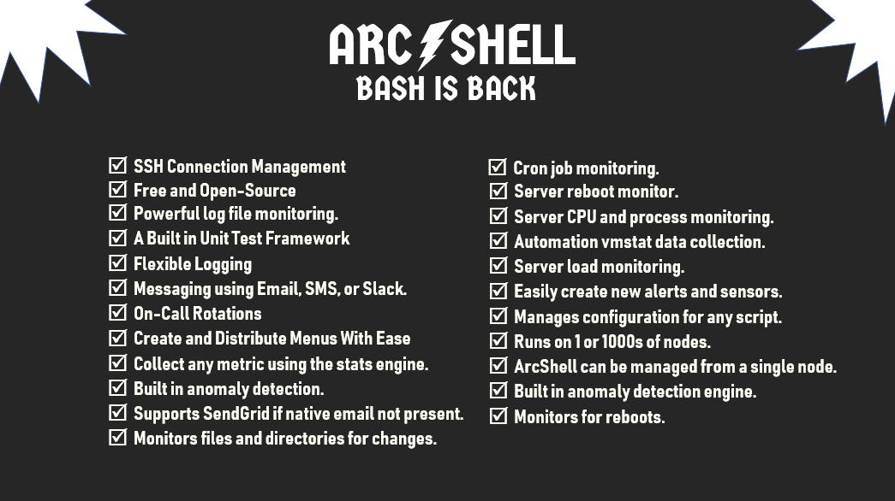

# ARCSHELL

ArcShell is a shell scripting, automation, and monitoring framework created by [Ethan Post](https://www.linkedin.com/in/ethanraypost/). 

It supports both Bash and Korn shells and contains more than [30 modules](https://github.com/arclogicsoftware/arcshell/tree/master/docs) that help you build amazing solutions. It can be up and running in a few minutes of time.

ArcShell is unique and unlike other Bash frameworks. It is designed to be used as a flexible distributed automation and monitoring development platform. It is suitable for both individuals and companies of any size.

Please join the [announcements](https://groups.google.com/forum/#!forum/arcshell-announcements) and [support](https://groups.google.com/forum/#!forum/arcshell) email lists for updates. I am on  [Twitter](https://twitter.com/poststop). You can also email me at Ethan@ArclogicSoftware.com. Chat channels will be created when needed.

Documentation and updates uploaded every week. Most of it will be available before the end of May 2019. 



Icons designs by SmashIcons and available from [Flaticon](https://www.flaticon.com/packs/essential-collection).

## BEFORE YOU START

Please read this. These points will get you oriented with the product before installing.

**My Development Environment:** ArcShell is developed in Bash using [Sublime Text](https://www.sublimetext.com/) on Windows. The Window's file system is shared to a [VirtualBox](https://www.virtualbox.org/) [Ubuntu](https://www.ubuntu.com/) host. You will see this often in my videos.

**Prerequisites:**  ArcShell has few, if any, prerequisites. You may need to install missing programs like awk or nawk, sed, bc, and perl. ArcShell does not and need to be installed as root in most cases.

**Email:** Ideally your servers have outbound email capability. If native email support is not already configured I suggest you try SendGrid which is easy to configure in ArcShell. If you require support for other options let us know what they are.

**SSH:** Your servers should support SSH. ArcShell can help you manage these connections. However, ArcShell is able to operate without it.

**Primary vs. Remote Nodes:** ArcShell is typically maintained on a single node and then deployed to your remote nodes. ArcShell deploys a copy of itself. There are many ways to manage deployments. 

**Loading ArcShell:** After you install ArcShell you will need to load the framework into your command line environment or into your script. This is done using the .arcshell profile file which is in your ${HOME} directory.
```
# Load ArcShell like this. This file is re-created anytime you run setup.
. ${HOME}/.arcshell
# It will only load once. To force a re-load set arcHome to nothing.
arcHome=
. ${HOME}/.arcshell
```

**Truthy values:** ArcShell makes use of something called truthy variables. Many configuration variables support the use of truthy values. Here are a few examples.
```
# A limited range of cron expressions are allowed.
foo="* * * * *"
# 1 is true, 0 false.
bar=1
# Most forms or True/False,Yes/No are allowable.
foo="y"
```
Look at the arcshell_cron.sh module for all of the options. 

**ArcShell Homes:** There are three ArcShell homes.

| Name| Path| About | 
| ---- | ---- | ---- |
| Delivered | ${arcHome} | This is the directory ArcShell is installed in. |
| Global | ${arcHome}/global or ${arcGlobalHome} | This is the directory where you will make 99% of your changes and where your files go. |
| User | ${arcHome}/user or ${arcUserHome} | This directory is not deployed to other nodes. |

We will see how these can be used later.

**Disk Space:** ArcShell doesn't take up much space initially. However, data collection tasks will eventually require additional resources. You should have at least 2-4 Gigabytes of space available for an ArcShell installation.

**Configuration:** The two main configuration files are arcshell.cfg and setup.cfg. 

| File| About| 
| ---- | ---- |
| ./config/arcshell/arcshell.cfg | Can be present in any of the three ArcShell homes. Is loaded (and run) whenever you source in ArcShell. |
| ./config/arcshell/setup.cfg | Can be present in any of the three ArcShell homes. Is loaded (and run) whenever you run setup. |

In both cases all files found are loaded and they are loaded in the following order: delivered, global, then user.

**ArcShell Daemon:** The script which acts as the daemon is ```${arcUserHome}/arcshell.sh```. This file also gets rebuilt each time you run setup. Run ```arcshell.sh -help``` for some help on starting and stopping the daemon process. 

After you install ArcShell you can add a single cronjob calling  ```arcshell.sh -autostart``` to make sure the daemon is restarted between server reboots if it was running prior to that event.

**Configuration Objects:** ArcShell has a powerful and flexible configuration file structure. You will want to take a close look at the following once you get ArcShell installed.

| Location| About| 
| ---- | ---- |
| ./config/arcshell | Stores the archell.cfg and setup.cfg files. | 
| ./config/keywords | Keywords are used to route messages to different delivery mechanisms. For example "warning" may send email but not send  an SMS message. |
| ./config/contact_groups | Contact groups determine who messages go to, how they get there, and when. They are very powerful and yet very easy to configure. |
| ./config/alert_types | Alert types set up recurring notifications. Each alert type has two phases of alerting which can be configured. |
| ./schedules | This folder contains scheduled tasks which are just .sh scripts. ArcShell provides a number of out-of-the-box solutions. You can also create your own schedules and add your scripts to them. |

In each of the cases above the configuration can exist in one or more of the three ArcShell homes. In some cases only the first file found is loaded or run and in others all three files are loaded and run in order. This is dependent on the code making use of the item. 

## INSTALL

**The following example is the simplest method of installing ArcShell.**
```
# Make sure you are in the bash shell.
$ echo $0
bash

# You can put ArcShell anywhere you want.
$ mkdir -p "${HOME}/app" && cd "${HOME}/app"
# ArcShell home will be in ${HOME}/app/arcshell when this completes.
$ bash < <(curl -Ss https://raw.githubusercontent.com/arclogicsoftware/arcshell/master/install.sh)
```

To install ArcShell manually step by step follow these instructions.
```
# If you want to see what the install.sh file looks like run this.
curl -Ss https://raw.githubusercontent.com/arclogicsoftware/arcshell/master/install.sh 

# Run the commands on the screen one by one manually.

```

The install log is written to your "${HOME}" directory.

**Try sourcing in the .arcshell file.**
```
# This sources ArcShell into your command line environment. 
. "${HOME}/.arcshell"
# You shouldn't see any errors! It might take a second or two to load.
```

## CONFIGURE

**Configure the arcshell.cfg file.**
```
# Copy the delivered .cfg file to your global configuration directory.
cp "${arcHome}/config/arcshell/arcshell.cfg" "${arcGlobalHome}/config/arcshell/"

# Edit the file. Instructions for each parameter are in the file.
vi "${arcGlobalHome}/config/arcshell/arcshell.cfg"

# Delete the lines you didn't explicity set. Not required but a good idea.

# Global config takes precedence over delivered config.
# User config takes precedence over global config.
# Avoid user level config at all costs!
```

**Configure the 'admins' contact group.**
```
# ArcShell has already copied the default 'admins.cfg' file to your global home.

# You probably only need to set 'group_emails' at this point. The other values can be set later.
vi "${arcHome}/config/contact_groups/admins.cfg" 

# You can add other groups by adding other files to this directory.
```

**Test send_message.**
```
# This returns a lot of information about your current settings related to messaging.
msg_show

# If outbound email is working this should result in an email message.
echo "ArcShell Test Email" | send_message -email "My First Test Email"
```

## DEPLOY 

**Create an SSH connection.**
The SSH Connection module is used to register SSH connections with ArcShell. 
```
# This creates a new connection. If the connection already exists it updates it.
ssh_add -alias "foo" -tags "dev,web" foo@server.com

# The result of running the above is a new configuration file for the connection.
vi "${arcGlobalHome}/config/ssh_connections/foo@server.cfg"

# You can optionally create more connections by creating the .cfg file directly.
```
Read more about the SSH Connection module [here](https://github.com/arclogicsoftware/arcshell/blob/master/docs/arcshell_ssh_connections.md).

**Deploy ArcShell to the new remote node over SSH.**
```
# Creates a deployment package from the local copy of ArcShell.
arc_pkg

# Uses the package we just created to install ArcShell on the remote node.
arc_install -ssh "foo" -arcshell_home "/home/foo/app/arcshell"
```

**Sync changes to the remote node over SSH.**
```
# Uses rsync to sync the local ArcShell home to the remote ArcShell home.
# The local ArcShell user home is not included in the sync.
arc_sync -ssh "foo"
```

**Stop and start the ArcShell daemon.**
```
# Starts the daemon.
nohup arcshell.sh start &

# Stops the daemon.
arcshell.sh stop
```

**Open the ArcShell menu.**
```
arc_menu
```

## WHAT'S NEXT

Spend some time looking at the two SSH related modules. One is used to [manage your SSH connections](https://github.com/arclogicsoftware/arcshell/blob/master/docs/arcshell_ssh_connections.md). The other is used to [run SSH commands against one or more nodes](https://github.com/arclogicsoftware/arcshell/blob/master/docs/arcshell_ssh.md).

Now is a also good time to review [keywords](https://github.com/arclogicsoftware/arcshell/blob/master/docs/arcshell_keywords.md), [contact groups](https://github.com/arclogicsoftware/arcshell/blob/master/docs/arcshell_contact_groups.md), and [alert types](https://github.com/arclogicsoftware/arcshell/blob/master/docs/arcshell_alerts.md).

The ArcShell [task scheduler](https://github.com/arclogicsoftware/arcshell/blob/master/docs/arcshell_sch.md) can be used to schedule tasks and deploy those scheduled tasks to your remote nodes. Review the list of delivered scheduled tasks [here](https://github.com/arclogicsoftware/arcshell/blob/master/docs/schedules.md). These scripts can be used a quick model to begin building your own custom solutions.

ArcShell makes it easy to:
* Add [logging](https://github.com/arclogicsoftware/arcshell/blob/master/docs/arcshell_logger.md), [debug](https://github.com/arclogicsoftware/arcshell/blob/master/docs/debug.md), and [counters](https://github.com/arclogicsoftware/arcshell/blob/master/docs/arcshell_counters.md) to your scripts.
* [Monitor log files.](https://github.com/arclogicsoftware/arcshell/blob/master/docs/arcshell_logmon.md)
* [Send messages](https://github.com/arclogicsoftware/arcshell/blob/master/docs/arcshell_msg.md) via email, SMS, or chat.
* Build [sensors](https://github.com/arclogicsoftware/arcshell/blob/master/docs/arcshell_sensor.md) are write  [alerts](https://github.com/arclogicsoftware/arcshell/blob/master/docs/arcshell_alerts.md).
* [Collect statistics.](https://github.com/arclogicsoftware/arcshell/blob/master/docs/arcshell_stats.md)
* [Build menus.](https://github.com/arclogicsoftware/arcshell/blob/master/docs/arcshell_menu.md)
* [Create charts.](https://github.com/arclogicsoftware/arcshell/blob/master/docs/arcshell_gchart.md)
* [Watch files and directories for changes.](https://github.com/arclogicsoftware/arcshell/blob/master/docs/arcshell_watch.md)
* Please review the list of all [modules](https://github.com/arclogicsoftware/arcshell/tree/master/docs) for more capabilities.


